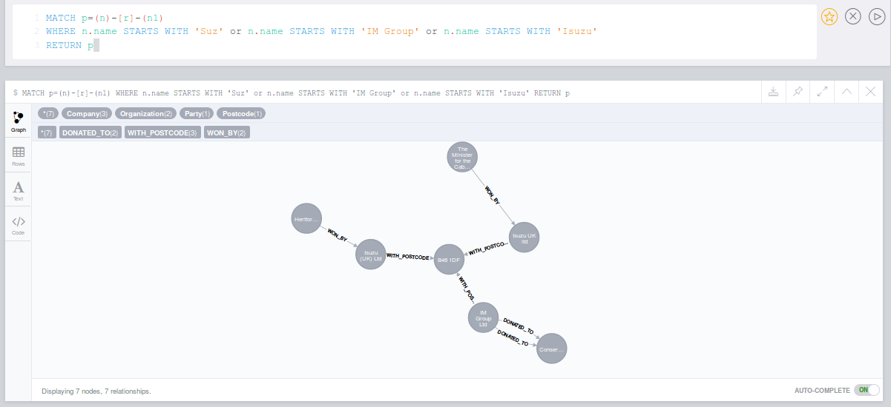
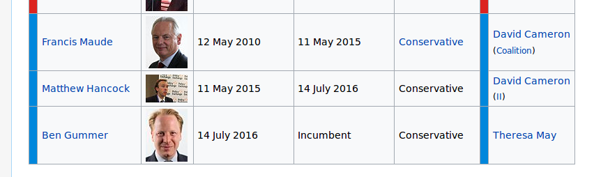

# Neo4j-Hackaton-2017
The results of the hackaton

https://www.meetup.com/graphdb-london/events/237040841/

at GraphConnect 2017 conference that led to the "Best Lead" award

## To reproduce the results

1:  
Save the file from  
Brexit - EU level datasetsTED - contract data - https://data.europa.eu/euodp/en/data/dataset/ted-1   
as TED_CAN_2015.csv (default name)   

2:  
At   
Donation data - http://search.electoralcommission.org.uk/   
choose
  * Select regulated group: Political party,
  * Select a type of search: Donations   

And filter in Search filters section by:
  * Time period: 2015-2017,
  * Donor status: Company
Save the second file as /partyCompanyDonations15_17.csv

## You will need Neo4j installed and running as well as the Python package

`neo4jrestclient`

## The rewarding result includes

where you could see that
* Isuzu UK ltd   registered with the same postcode   won a tendor by  
The Minister for the Cabinet Office acting through Crown Commercial Service   with 41 total number of offers,   awarded on
2014-12-02  
with the tendor value  so big that i could not make sense of it (3444285241.93)
* the donation of £250,000.00  
from  IM Group Ltd   that was accepted (2015-01-20)  
by the Conservative and Unionist Party

Interestingly Minister for the Cabinet Office positions has been held by the conservatives since 2010
https://en.wikipedia.org/wiki/Minister_for_the_Cabinet_Office

